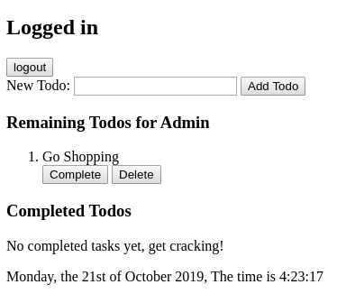

# Test Cases

### Testcase 5.1: User can access his/her own todo list.

## Input
- Testcase 1.7

## Output:

- Testcase 1.7
- The text "New Todo:" is shown.
- An empty textarea is shown.
- A button with the text "Add Todo" is shown.
- The  text "Remaining Todos for Admin" is shown.
- The text "Nothing to do yet" is shown.
- The text "Completed Todos" is shown.
- Teh text "No completed tasks yet, get cracking!" is shown.

### Test Case 6.1: Adding Todos

## Input
- TestCase 5.1
- Enter "Go Shopping".
- Press "Add Todo" button.

## Output
- The text "1. Go Shopping" is shown
- A "Complete"-button is shown.
- A "Delete"-button is shown.
