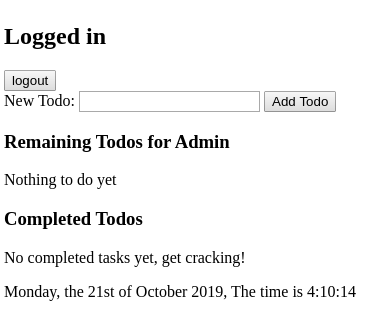

# Test Cases

## Testcase 5.1: User can access his/her own todo list.

### Input
- Testcase 1.7

### Output:

- Testcase 1.7
- The text "New Todo:" is shown.
- An empty textarea is shown.
- A button with the text "Add Todo" is shown.
- The  text "Remaining Todos for Admin" is shown.
- The text "Nothing to do yet" is shown.
- The text "Completed Todos" is shown.
- The text "No completed tasks yet, get cracking!" is shown.

## Test case 5.2: User has his/hers private todo-list

This one i don't know how to write.
If you login with "Admin" and "Password" and run the testcases 6 and 7 an logout.
Then login with "Admin1" and "Password1" and the name presented by "Remaining Todos for" should be "Admin1" and other todo-items should be listed. 

## Test Case 6.1: Adding Todos

### Input
- TestCase 5.1
- Enter "Go Shopping".
- Press "Add Todo" button.

### Output
- The text "1. Go Shopping" is shown
- A "Complete"-button is shown.
- A "Delete"-button is shown.

## Test Case 7.1: Complete a todo

### Input
- TestCase 6.1
- Press "Complete" button.

### Output
- The text "Go Shopping" is shown
- A "Delete"-button is shown.

## Test Case 8.1: Delete a completed todo

### Input
- TestCase 7.1
- Press "Delete" button.

### Output
- The text "Go Shopping" is removed
- The text "No completed tasks yet, get cracking!" is shown instead

## Test Case 8.2: Delete a uncompleted todo

### Input
- TestCase 6.1
- Press "Delete" button.

### Output
- The text "Go Shopping" is removed
- The text "Nothing to do yet" is shown instead

